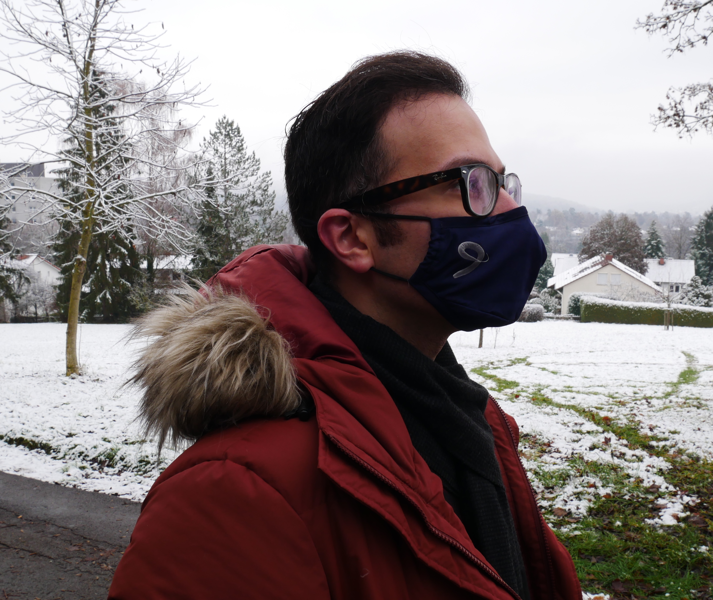

[bio](index.md) :: [CV](Kalirad_CV_2022_summ.pdf) :: [Seleted Publications](pub.md)

## Ata Kalirad

I am evolutionary biologist, currently a Postdoctoral researcher at [Max-Planck-Institut für Entwicklungsbiologie](). I am fascinated by the diversity of life on earth and the fundamental processes that have driven the multitude of living forms. This fascination has led me to try to understand speciation and evolvability form a computational perspective, and the role of plasticity in the emergence of diversity by studying polyphenism in _Pristionchus_.

