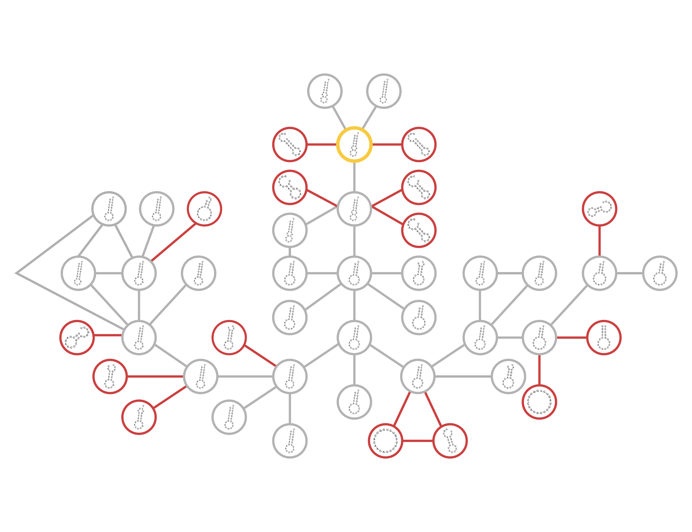

## Ata Kalirad, PhD

I am currently  a Postdoctoral researcher at [Max-Planck-Institut für Entwicklungsbiologie](). 

[My résumé.](Kalirad_CV_2021.pdf)

## Selected publications 

### Spiraling Complexity: A Test of the Snowball Effect in a Computational Model of RNA Folding, Kalirad and Azevedo, 2017, _Genetics_

**Abstract**

>Genetic incompatibilities can emerge as a byproduct of genetic divergence. According to Dobzhansky and Muller, an allele that fixes in one population may be incompatible with an allele at a different locus in another population when the two alleles are brought together in hybrids. Orr showed that the number of Dobzhansky-Muller incompatibilities (DMIs) should accumulate faster than linearly—i.e., snowball—as two lineages diverge. Several studies have attempted to test the snowball effect using data from natural populations. One limitation of these studies is that they have focused on predictions of the Orr model, but not on its underlying assumptions. Here, we use a computational model of RNA folding to test both predictions and assumptions of the Orr model. Two populations are allowed to evolve in allopatry on a holey fitness landscape. We find that the number of inviable introgressions (an indicator for the number of DMIs) snowballs, but does so more slowly than expected. We show that this pattern is explained, in part, by the fact that DMIs can disappear after they have arisen, contrary to the assumptions of the Orr model. This occurs because DMIs become progressively more complex (i.e., involve alleles at more loci) as a result of later substitutions. We also find that most DMIs involve >2 loci, i.e., they are complex. Reproductive isolation does not snowball because DMIs do not act independently of each other. We conclude that the RNA model supports the central prediction of the Orr model that the number of DMIs snowballs, but challenges other predictions, as well as some of its underlying assumptions.

[https://doi.org/10.1534/genetics.116.196030](https://www.genetics.org/content/206/1/377)

