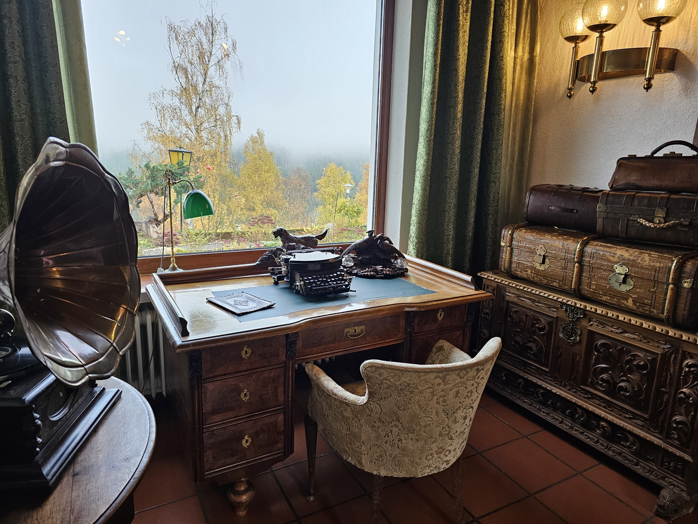

 :: [Selected Publications](pub.md) :: [Resources](resources.md) :: [CV](CV_Ata_Kalirad_Nov2024.pdf) :: [Presentations](presentations.md) :: [Outreach](outreach.md) ::  :: 

I am an evolutionary biologist, currently a Postdoctoral researcher at
[Max-Planck-Institut für Biologie Tübingen](). I am fascinated by the diversity of
life on earth and the fundamental processes that have driven the multitude
of living forms. This fascination has led me to try to understand
speciation and evolvability form a computational perspective, and the role
of plasticity in the emergence of diversity by studying polyphenism in
_Pristionchus_.

_A photo from a cozy hotel in Titisee-Neustadt, taken in Winter 2024._ 