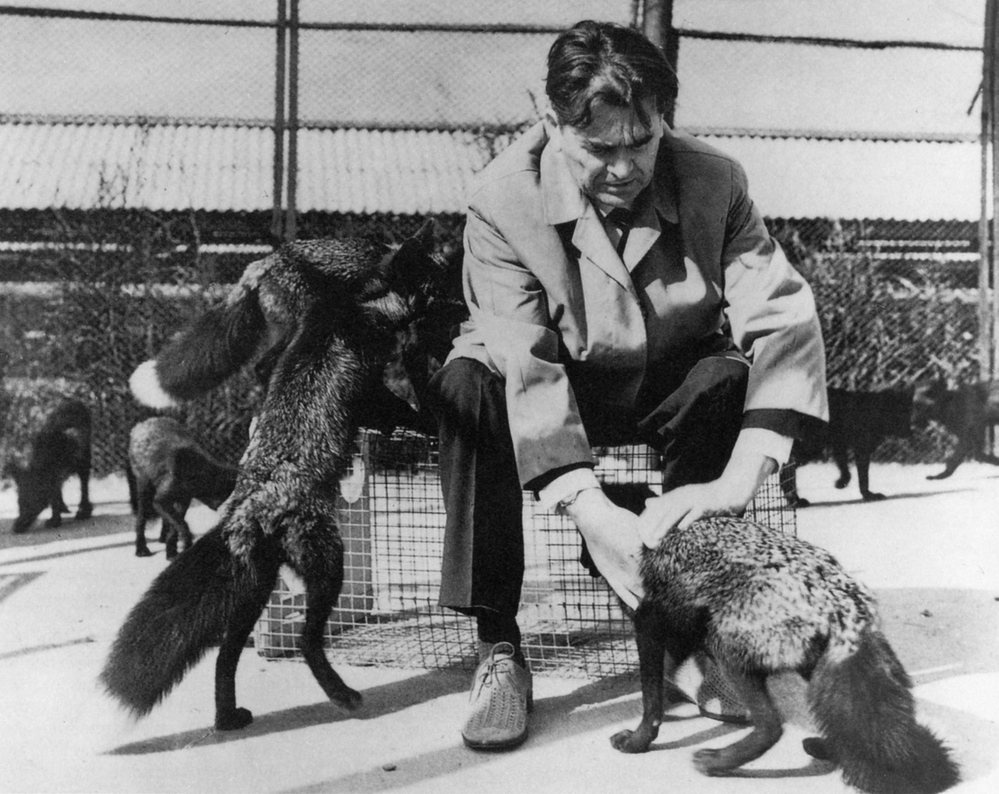
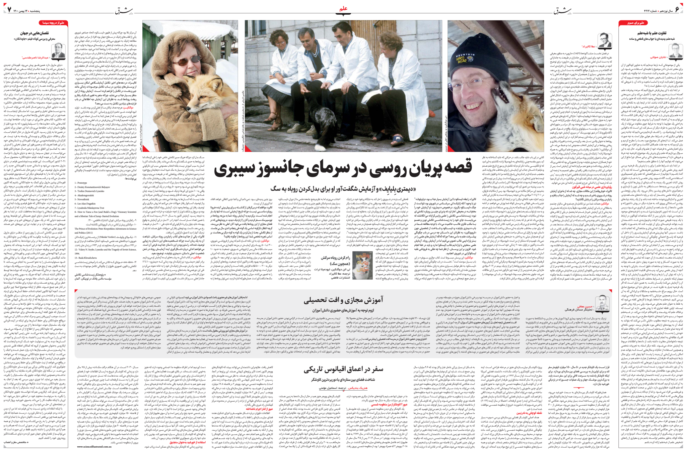

[Home](index.md) :: [Selected Publications](pub.md) :: [Resources](resources.md) :: [Google Scholar](https://scholar.google.com/citations?user=phcVCbAAAAAJ&hl=en) :: [CV](CV_Ata_Kalirad_Nov2024.pdf) :: [Presentations](presentations.md) :: [Outreach](outreach.md) 

## How do you say _How to Tame a Fox_ in Persian?

Back in 2015, when acting as the TA for an evolution course that was being taught by, Ricardo Azevedo, my PhD advisor, and Diane Wiernasz, I came across the fox experiment; an experiment that started in the 1950s in the Soviet Union, and was designed to test if selective breeding could lead to domestication of silver foxes. Everything about it seemed intriguing, and I was quite puzzled; how could someone in the Soviet Union start a very Darwinian research project in the 1950s when the entire soviet genetics was being purged by Lysenko and his clique? 

First, it might be useful to recap the experiment: Dmitri Belyaev, a Russian geneticist was inspired by Charles Darwin's Variation under Domestication in Plants and Animals (1868) and conceived a domestication experiment in which a wild species will be subjected to selection for docility. For the experiment, he chose the silver fox, a variant of the red fox (_Vulpes vulpe_). The experiment started in 1959 at the Institute of Cytology and Genetics in Novosibirsk, Siberia. During the experiment, as the result of the selective breeding, drastic behavioral and morphological changes occurred in the population under domestication. 

_Dmitry K. Belyaev with the silver foxes (photo from: [Early canid domestication: the farm-fox experiment. Am Sci. 1999;87:160–9.](https://www.jstor.org/stable/27857815))_ 

After reading a paper by Lyudmila Trut, one of the key researchers involved in Belyaev’s experiment from the beginning (Early canid domestication: the farm-fox experiment. Am Sci. 1999;87:160–9.), the circumstances of the experiment became slightly more clear to me, but I sensed that there should be much more to the story. The scientific milieu in the soviet union at the time of the start of the experiment should have been simply too hostile towards any such blatant attempt to test a Darwinian hypothesis; Trofim Denisovich Lysenko had successfully launched a campaign in the mid 1930s to rid the soviet biology of “reactionary” geneticists, i.e., those who believed in the tenets of genetics as described by Gregor Mendel and Thomas Hunt Morgan. Lysenko’s campaign successfully derailed the plans to hold the VII international congress of genetics in Moscow in 1937 and ended the careers of many geneticists in Russia, including Nikolay I. Vavilov, Izrail Iossofovich Agol, and Ivan Ivanovich Schmalhausen. It should be noted that Vavilov and Agol lost their lives alongside their careers. (A superb, and heartbreaking, account of the ill-fated congress of genetics in Moscow can be found in [Soyfer VN. Tragic history of the VII International Congress of Genetics. Genetics. 2003;165(1):1-9. doi:10.1093/genetics/165.1.1](https://doi.org/10.1093/genetics/165.1.1).)

Given all these fascinating social and political issues related to the fox experiment, I was thrilled to find out that Lee Dugatkin and Lyudmila Trut wrote a book about the fox experiment, How to Tame a Fox (and Build a Dog): Visionary Scientists and a Siberian Tale of Jump-Started Evolution, which I read almost immediately after its publication in March 2017. What had added to my excitement was the fact that Lee was involved; I had known Lee through his fantastic textbooks, _Evolution_ co-written with the inimitable Carl Bergstrom, and _Principles of Animal Behavior_, two books that I have relied upon in teaching since I finished my PhD. I also had read Lee’s _The Prince of Evolution_ (2011), which masterfully tells the fantastic life of Peter Kropotkin in science and politics. I am generally quite anxious to open a popular science book by a journalist or an enthusiast, simply because too often I find that they try their hardest to test my patient with too many scientific inaccuracies (although, I have to admit that there are quite a few exceptions to my instinctive reluctance on this issue, exemplified by the fantastic works of Carl Zimmer). 

After finishing _How to Tame a Fox_, I became such a fan that I decided to translate the book into Persian, my mother tongue. I contacted Lee and he promptly and graciously agreed. Through a friend in Iran, I contacted Fatemi publishing house in Iran and they agreed to publish the translation. (I have to go on a small tangent here: having this work published by Fatemi publication was quite uplifting on two accounts; they are a renowned publishing house in Iran, specialised in publishing scientific and popular science books, and I had spent many years in my childhood reading popular science books published by them, including a box set of Isaac Asimov’s _How Did We Find Out_ series. This box set, which I still have, was bought by my father after I went through a grueling bout of the flu to cheer me up, and as far as I recall, I was happy beyond belief after receiving it!)

_The original cover and the cover of the Persian translation of How to Tame a Fox._

During the start of the pandemic, as I was finishing up the translation, the people at Fatemi publishing house asked me to interview Lee about the book, so they would use the clips of the interview in the run up to the publication of How to Tame a Fox in Iran. I asked Lee about this and he, being an absolute gentleman, agreed to it. The interview was done over zoom on September 2nd, 2020. The abridged transcript of the interview was later published by [Shargh newspaper](https://en.wikipedia.org/wiki/Shargh) in Iran.

_The abridged transcript of my conversation with Lee, published in Shargh newspaper._

Here's the video of my conversation with Lee in its entirety on How to Tame a Fox. I have to apologize beforehand for the quality of the video, as it was done without any professional equipment:  

