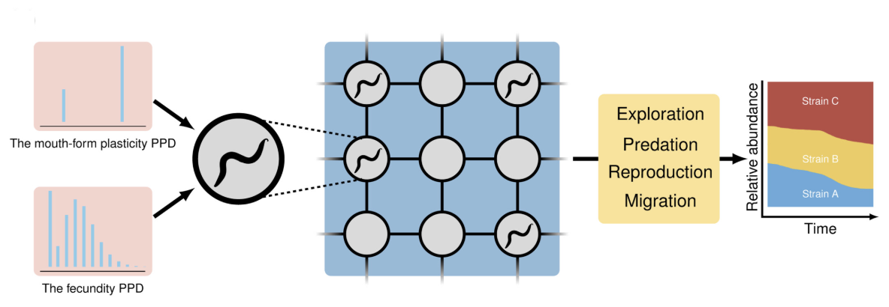
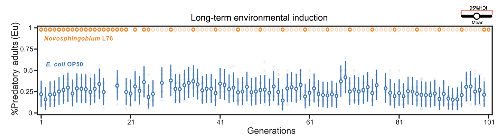
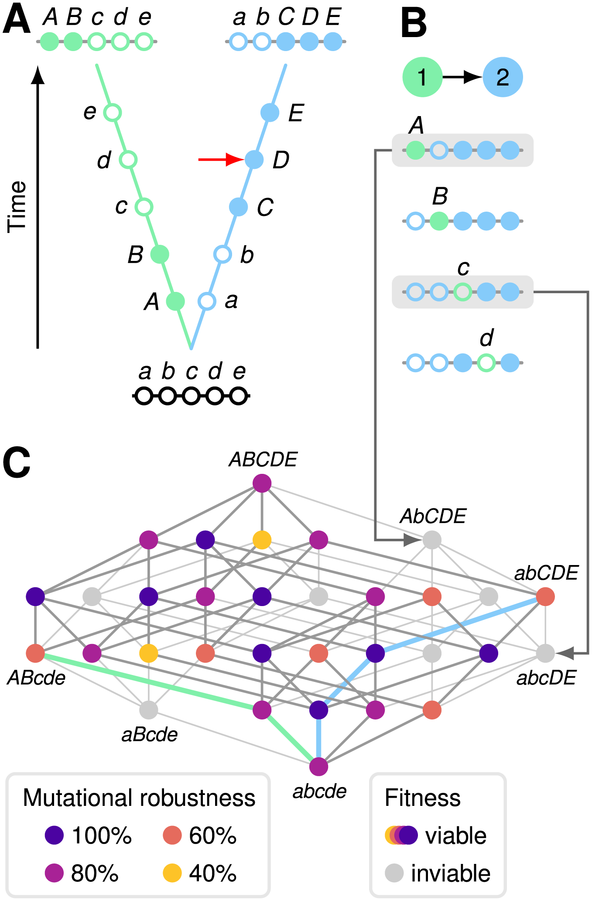
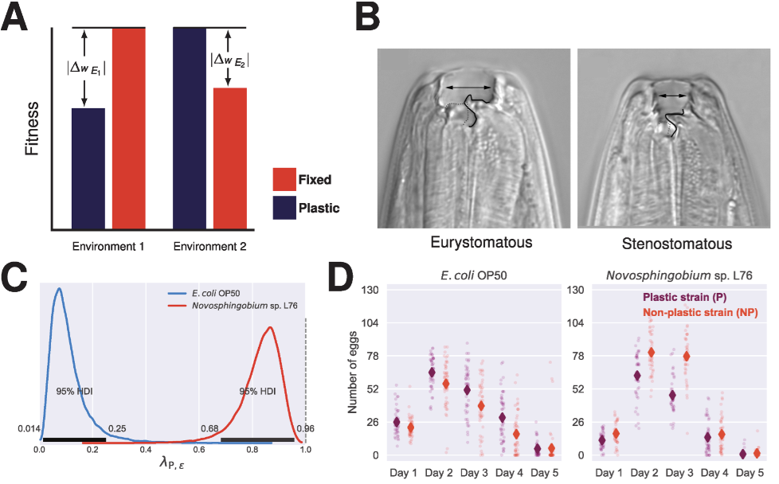
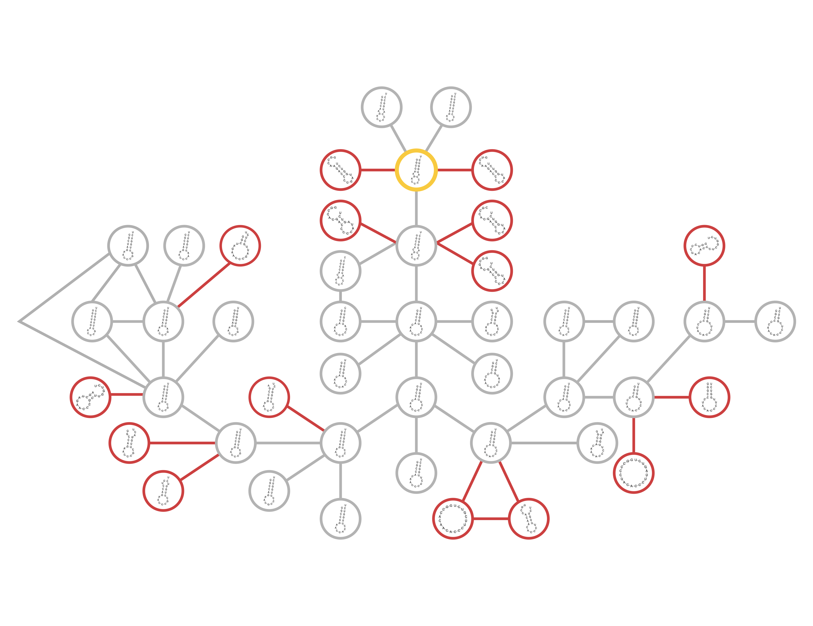
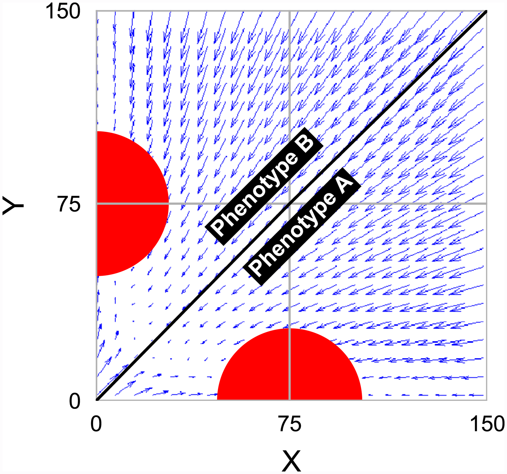

[bio](index.md) :: [CV](CV_Ata_Kalirad_Nov2024.pdf) :: [Seleted
Publications](pub.md) :: [Google
Scholar](https://scholar.google.com/citations?user=phcVCbAAAAAJ&hl=en)

## Selected publications 

### The role of plasticity and stochasticity in coexistence, Kalirad and Sommer, 2024, _Ecology Letters_ 

**Summary**

This research uses the nematode _Pristionchus pacificus_ to explore how
phenotypic plasticity, specifically in mouth form, and stochasticity
influence species coexistence. The study integrates laboratory experiments
measuring plasticity and fecundity under different diets with an
individual-based model (PriPOP) to simulate competition between _P.
pacificus_ strains. Results suggest that while phenotypic plasticity alone
leads to competitive exclusion, the addition of stochasticity in founder
populations allows for more complex dynamics, potentially enabling
coexistence in a metapopulation setting. The findings challenge traditional
coexistence theories by highlighting the significant role of stochasticity
and individual variation in shaping community structure. The research also
introduces PriPOP as a novel modeling framework for incorporating
experimental data and multiple sources of stochasticity in ecological
studies.

[https://doi.org/10.1111/ele.14370](https://onlinelibrary.wiley.com/doi/full/10.1111/ele.14370)

### EBAX-1/ZSWIM8 destabilizes miRNAs resulting in transgenerational memory of a predatory trait, 2024

**Summary**

This research explores transgenerational epigenetic inheritance (TEI) in
the nematode _Pristionchus pacificus_. Using a long-term environmental
induction experiment with varying diets, the study demonstrates that
dietary changes induce a predatory morph with lasting transgenerational
effects. A forward genetic screen identified ebax-1/ZSWIM8, a ubiquitin
ligase, and a heavily expanded miR-2235a/miR-35 miRNA family as key
regulators of this TEI. Mutations in ebax-1 eliminate the transgenerational
memory, while deletions of the miR-2235a locus enhance it. The findings
suggest a novel role for miRNAs in TEI, potentially through a
target-directed miRNA degradation mechanism.

[https://doi.org/10.1101/2024.09.10.612280](https://www.biorxiv.org/content/10.1101/2024.09.10.612280v1)

### Genetic drift promotes and recombination hinders speciation on holey fitness landscapes, Kalirad, Burch, and Azevedo, 2024, _PLoS Genetics_

**Summary**

This research article uses computer simulations to explore how genetic
drift and recombination influence speciation rates. The study finds that
genetic drift in small populations accelerates the accumulation of genetic
incompatibilities, promoting speciation, while recombination slows this
process by increasing genetic robustness. Two models, a simplified "Russian
roulette" model and a more realistic RNA folding model, support these
findings. Finally, the researchers analyze Drosophila data, finding
correlations consistent with their simulation results, suggesting that
population size and recombination rate affect speciation in nature

[https://doi.org/10.1371/journal.pgen.1011126](https://doi.org/10.1371/journal.pgen.1011126)

### Spatial and temporal heterogeneity alter the cost of plasticity in _Pristionchus pacificus_, Kalirad and Sommer, 2024, _PLoS Computational Biology_

**Summary**

This research article investigates the cost of phenotypic plasticity, the
ability of organisms to express different traits depending on the
environment, using the nematode _Pristionchus pacificus_ as a model. The
authors combine laboratory data on _P. pacificus_ mouth-form plasticity
with a stage-structured population model to simulate how spatial and
temporal resource heterogeneity affects the cost of plasticity in
competition between plastic and non-plastic strains. The study finds that
spatial and temporal heterogeneity can alleviate the cost of plasticity,
allowing the plastic strain to compete more effectively. The model
incorporates factors like life-history intraguild predation and dauer larva
dispersal to create a more realistic representation of the nematode's
ecology. The findings highlight the complexity of predicting the ecological
consequences of phenotypic plasticity in fluctuating environments.

[https://doi.org/10.1371/journal.pcbi.1011823](https://doi.org/10.1371/journal.pcbi.1011823)

### Spiraling Complexity: A Test of the Snowball Effect in a Computational Model of RNA Folding, Kalirad and Azevedo, 2017, _Genetics_

**Summary**

This research article investigates the snowball effect, a hypothesis
proposing that reproductive isolation between diverging populations
increases exponentially with genetic distance. Using a computational model
of RNA folding, the study tests both the predictions and assumptions of
Orr's model of Dobzhansky-Muller incompatibilities (DMIs). The findings
confirm the snowballing of DMIs but reveal a slower-than-expected rate,
partly due to DMIs becoming more complex over time and not acting
independently. The study challenges the assumption that simple DMIs persist
indefinitely and highlights the influence of fitness landscape structure on
DMI accumulation. Overall, the research provides mixed support for Orr's
model, suggesting refinements are needed to fully capture the dynamics of
reproductive isolation.

[https://doi.org/10.1534/genetics.116.196030](https://www.genetics.org/content/206/1/377)

### Noise-driven cell differentiation and the emergence of spatiotemporal patterns, Safdari, Kalirad, et al., 2020, _PLOS ONE_

**Summary**

This PLOS ONE research article presents a noise-driven differentiation
(NDD) model of cell differentiation and pattern formation. The model
incorporates intrinsic cellular noise, stochastic cell division, and cell
signaling to explain how phenotypic diversity emerges and leads to
spatiotemporal patterns in cell populations. Simulations using a cell
aggregation model support the model's predictions, showing that noise alone
can generate heterogeneity, while signaling introduces spatial order. The
authors compare their model to existing models, highlighting its unique
approach of separating and analyzing different noise sources. Finally, the
study discusses the implications of the NDD model for understanding the
evolutionary transition from unicellularity to multicellularity.

[https://doi.org/10.1371/journal.pone.0232060](https://journals.plos.org/plosone/article?id=10.1371/journal.pone.0232060)

Summaries were generated by [NotebookLM](https://notebooklm.google).